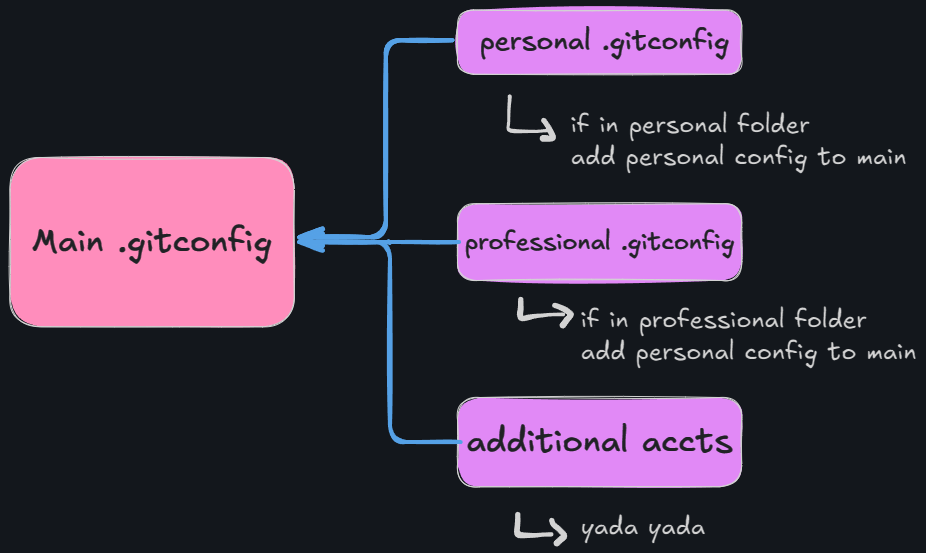

# Setting Up Multiple GitHub Accounts In VScode

- [Setting Up Multiple GitHub Accounts In VScode](#setting-up-multiple-github-accounts-in-vscode)
    - [The Goal:](#the-goal)
    - [How It Works:](#how-it-works)
    - [Note](#note)
    - [1. Setting Up SSH](#1-setting-up-ssh)
    - [2. SSH Agent](#2-ssh-agent)
    - [3. Creating ~/.ssh Config file](#3-creating-ssh-config-file)
    - [4. Creating Git Configs](#4-creating-git-configs)
    - [4.1 Main .gitconfig File](#41-main-gitconfig-file)
    - [4.2 The Other .gitconfig Files](#42-the-other-gitconfig-files)
    - [el fin](#el-fin)


### The Goal:

I wanted a way to push and pull to separate github accounts, all while maintaining VScodes source control functionality, without worrying about using the wrong account for commits. Most importantly there is no need to swap accounts in VScode. With this method, all ssh identification and verification are handled automatically.

### How It Works:

Create directories for each account somewhere on your PC and each folder acts as a "vault" for that GitHub account. So, for example, in my case i made 2 folders [Personal, Professional] and any time i clone a repo, say 'personal-repo', into them from its associated GitHub (using ssh ofcourse) the proper ssh key, username, and email address is used. If i move 'personal-repo' out of the 'Personal' folder credentials will not be supplied and will fail to push.

### Note

It's important to note that your current .gitconfig may already have a username and email that will be used by default on anything outside of the folders we create here in this guide. I don't think you need to remove those entries, but I recommend it. If you choose not to, at least put the changes we're going to make *below* the default values that way we override them. I cover this more in [4. Creating Git Configs](#4-creating-git-configs)

<!-- TODO: update the above link when its written -->

### 1. Setting Up SSH

Open up file explorer (windows key + E for short). Goto `C:\Users\<your username>\.ssh`. if .ssh doesn't exist first enable hidden files and folders. if you still don't see it, create a hidden folder named ".ssh". Once in .ssh, shift + right click and click on 'open powershell window here'

I'm going to pretend you don't have any ssh keys setup so lets go ahead and make a few. enter this into powershell:
```
ssh-keygen -t ed25519 -C "<comment>" -f <key-name>
```
  - replace `<comment>` with a comment name for your key. and `<key-name>` with the name of the file you want the key to be.
- you don't have to enter a passphrase.
- make as many keys as you have accounts. I had 2 so i made 2 keys 

### 2. SSH Agent

Now that we got our keys generated we need to add them to our SSH agent. Let's start our SSH agent in the same powershell window with this command
```
eval `ssh-agent -s`
```
Next add our generated SSH keys to the agent using the below command.
```
ssh-add ~/.ssh/<key-name>
```
- Replace `<key-name>` with the name of the ssh key file you created in step 1
- Don't forget DO THIS FOR EACH KEY YOU CREATED.

Great now that you got that all setup lets add the corresponding SSH keys to their rightful GitHub accounts. This is straightforward enough so I'll give you the short version.

Log in to each GitHub account and go to `https://github.com/settings/ssh/new`, give it a fancy shmancy title, leave it at authentication key, and paste in your .pub file for the corresponding key that we just generated in the .ssh folder.

So in my case I copy the text from `C:\Users\Your Average Mo\.ssh\PersonalSSH.pub` into my personal GitHub account.

### 3. Creating ~/.ssh Config file
  
We need to make a config file inside the same .ssh folder where we made the SSH keys. If you already have a config file in the .ssh folder you can open that one up and just comment out the previous code. If not, inside the same powershell window input these line by line:

```
touch config
code config
```

The `code config` should open the file we just made in vscode. Now in that file copy paste this:
```
Host *
  IgnoreUnknown AddKeysToAgent,UseKeychain
  AddKeysToAgent yes
  UseKeychain yes
  IdentityFile ~/.ssh/<key-name>
```

- This 'IdentityFile' ssh key is the default key that will be used  
- But this time only put one ssh key in the `<key-name>`. In my case I choose my personal key.

### 4. Creating Git Configs

Ok almost there. This is the part that kind of stumped me but I'll walk you through it. We need to go to our root dir where our .gitconfig file is normally saved. So in the same powershell window just type:
```
cd ~
```

In this dir you should already have a *hidden* .gitconfig file. So I'd double check that and either copy paste it somewhere as a backup or just change it accordingly if you know what you're doing. Don't worry you really can't screw things up here- too bad at least...

For the rest of us, I'm going to pretend like you don't have one so let's go ahead and create 3 new .gitconfig files in this root dir. I'll explain them after.

```
touch .gitconfig
touch .gitconfig.professional
touch .gitconfig.personal
```
You can name 'professional' and 'personal' whatever you'd like, that's just what I named them. Just keep in mind that we reference these files later while editing them so if you're going to change the names make sure you do in the steps down below as well.

Also if you made more SSH keys and had more GitHub accounts you're trying to link, use the same touch command to make .gitconfig files for them also. I.e. `touch .gitconfig.school`, `touch .gitconfig.secret`



Here's an explanation. As you can see from my awesome flowchart, in the main .gitconfig we are adding a few simple if statements. This basically says "if the current repo is in personal/professional dir, include the contents of the corresponding .gitconfig files."

### 4.1 Main .gitconfig File
So let's start with the main .gitconfig file. Open that bad boy up in vscode or just type `code .gitconfig` in the same powershell. You might already see something like (not necessary though) `[core] editor = \"C:\\Users\\...`, below that at the bottom paste this:

```
[includeIf "gitdir:C:/path/to/dir/"]
path = ~/.gitconfig.professional
```
- in this case `/path/to/dir/` is the folder you decided you wanted to be the "vault" for the corresponding GitHub account. You know... the thing I was talking about at [How It Works:](#how-it-works)
- And the `path =` is the file that we just created above. If you named it something else make sure to follow through with that here too.
- Make sure to **not** mix up GitHub accounts here... definitely *not* speaking from experience.

You'll want to repeat this part for every GitHub account you're trying to link. So in my case I had to [includeIf] statements in my main .gitconfig. One for professional and one for personal.

Finally at the very bottom of that main .gitconfig file paste this:
```
[core]
excludesfile = ~/.gitignore
```

### 4.2 The Other .gitconfig Files

The hard part is mostly out of the way. Let's handle those other .gitconfig files we made for personal and professional. You're going to want to repeat these next few steps for each additional GitHub you're trying to link up.

Open those up in vscode again and paste this into them:
```
[user]
email = <github-email-address>
name = <associated-name>
 
[github]
user = "<github-username>"
 
[core]
sshCommand = "ssh -i ~/.ssh/<key-name>"
```
- keep the quotes
- the 4 items you need to change are `<github-email-address>`, `<associated-name>`, `<github-username>`, and `<key-name>` (the corresponding SSH key we made in step 1)

### el fin

Annnd that's it! Once you've done that for all the GitHub accounts they should work properly. 

Now just test it by git cloning using SSH from your personal GitHub into the personal folder try pushing. Check if the commit profile matches correctly on GitHub.com. Then move the cloned repo to your professional folder, you shouldnt be able to push. Try the same for your professional account.

Remember to keep in mind the [Note](#note) I left. 

Credit:  
i used [this blog](https://javascript.plainenglish.io/how-to-manage-multiple-github-accounts-in-vscode-using-ssh-keys-7f1a3adef58a) as a guide when setting up mine. Check it out if you need more info.